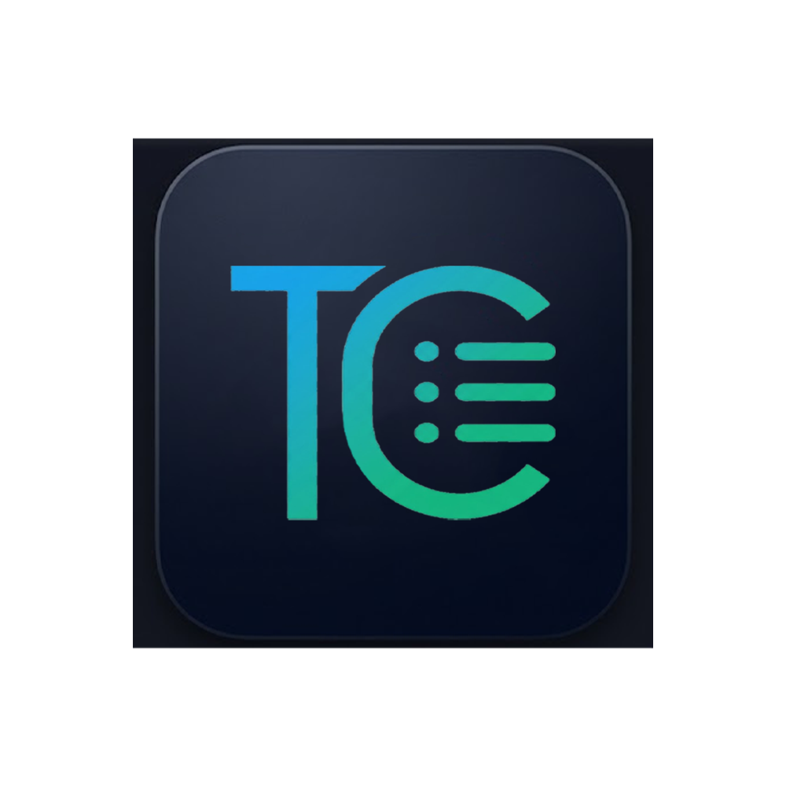
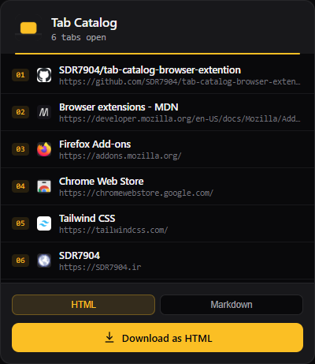

# Tab Catalog

Capture every open tab in your current window and export it as a self-contained **HTML** or **Markdown** catalog — one click, no accounts, no syncing, no data collection.

<p align="center">
  
</p>

<p align="center">
  
</p>

Works on **Chrome / Edge / Brave** and **Firefox 142+** (Manifest V3).

## Features

- **One-click capture** — reads every tab in the current window when you open the popup
- **HTML export** — dark-themed catalog with live search and per-tab copy buttons
- **Markdown export** — GitHub-friendly table of favicon / title / domain
- **Offline-first popup** — system fonts only; no network needed to open the UI
- **Smart favicons** — browser cache first, Google favicon service as fallback
- **XSS-safe** — titles and URLs are escaped before rendering or export
- **Minimal permissions** — only `tabs`; downloads use a Blob URL (no `downloads` permission)

## Installation

### Chrome / Chromium / Edge / Brave

1. Clone or download this repository:
   ```bash
   git clone https://github.com/SDR7904/tab-catalog-browser-extention.git
   ```
2. Open `chrome://extensions` (or `edge://extensions`).
3. Enable **Developer mode**.
4. Click **Load unpacked** and select this project folder.
5. Pin Tab Catalog to your toolbar.

### Firefox

1. Clone or download this repository (same folder as above).
2. Open `about:debugging#/runtime/this-firefox`.
3. Click **Load Temporary Add-on…**.
4. Select `manifest.json` in this folder.

Temporary add-ons are removed when Firefox restarts. For a permanent install, build with [`web-ext`](https://github.com/mozilla/web-ext) and sign via [addons.mozilla.org](https://addons.mozilla.org/developers/):

```bash
npm install --global web-ext
web-ext lint
web-ext build
```

## Usage

1. Click the Tab Catalog icon in your toolbar.
2. Review the list of open tabs.
3. Choose **HTML** or **Markdown**.
4. Click **Download**. The file is saved as `tab-catalog-YYYY-MM-DD.html` or `.md`.
5. Open the HTML file in any browser to search or copy tabs.

## Project structure

```
tab-catalog-browser-extention/
├── manifest.json   # Manifest V3 (+ Firefox gecko settings)
├── popup.html      # Popup markup
├── popup.css       # Popup styles (system fonts)
├── popup.js        # Tab capture + HTML/Markdown builders
├── icons/          # Toolbar icons
├── docs/           # README images
├── LICENSE
└── README.md
```

## How it works

- Queries open tabs with `browser.tabs.query({ currentWindow: true })` (falls back to `chrome.*` on Chromium).
- Builds exports as a `Blob` and triggers download via a temporary `<a download>` link.
- Embeds the extension icon as a base64 data URI so exported files stay portable.

## Permissions

| Permission | Why |
|---|---|
| `tabs` | Read title and URL of each open tab in the current window |

No host permissions, no background scripts, no data collection.

## Browser support

- Google Chrome, Microsoft Edge, Brave, Opera, and other Chromium browsers (MV3)
- Firefox 142+ (MV3; `browser_specific_settings.gecko` declared in `manifest.json`)

## Contributing

Issues and pull requests are welcome. Please open an issue for bugs or feature ideas before large changes.

## License

MIT — see [`LICENSE`](./LICENSE).

## Author

[SDR7904](https://github.com/SDR7904) · [SDR7904.ir](https://SDR7904.ir)
